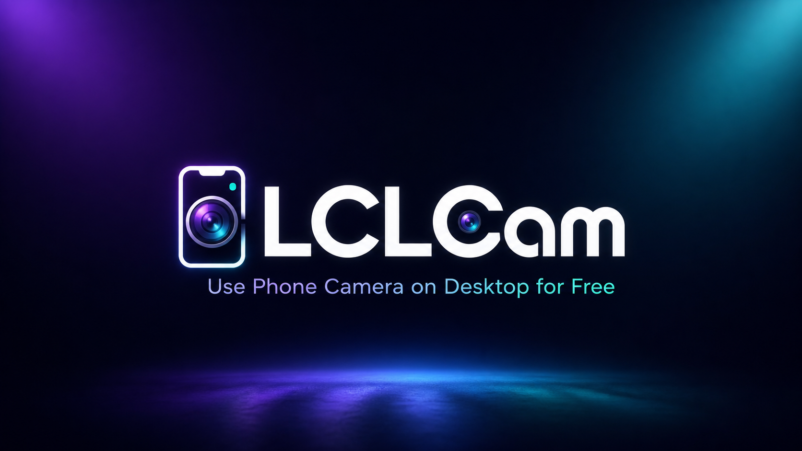
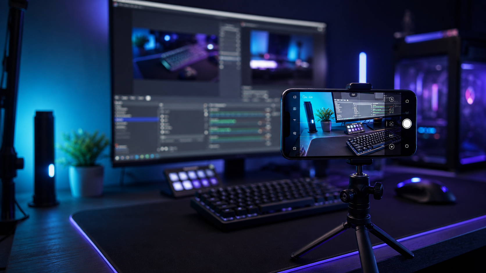
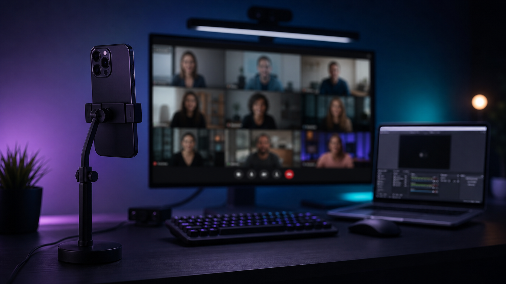
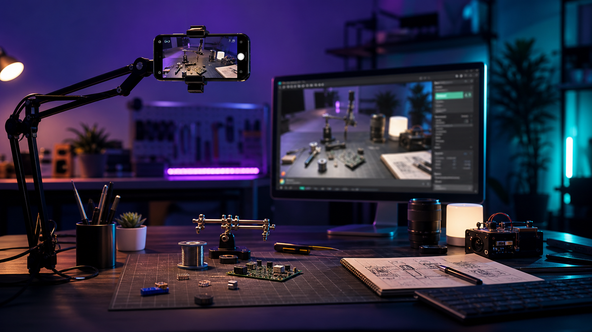
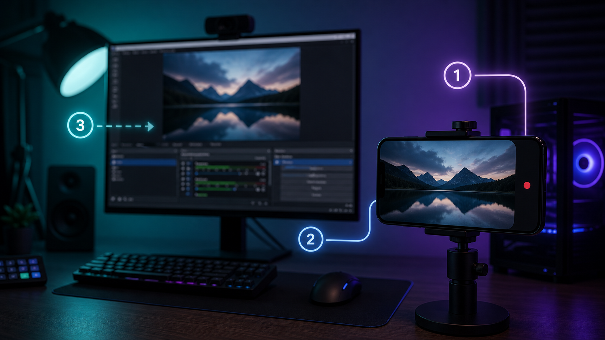
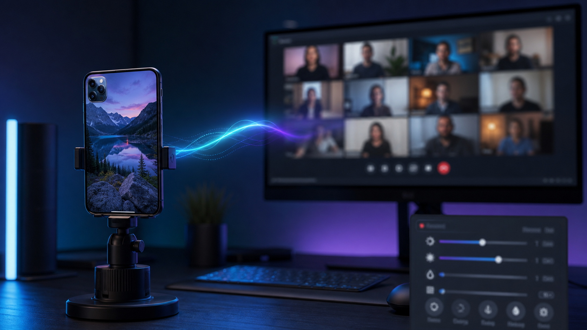

# LCLCam

Open-source local phone camera studio for OBS, streaming, video calls, tutorials, demos, and desk setups.

LCLCam lets you scan a QR code with your phone and use that phone camera as a live browser camera source on your desktop. It is designed for people who want extra camera angles on the same local network without cloud video processing, accounts, subscriptions, payments, or external auth services.



## What it does

- Creates a local Studio dashboard at `/`
- Generates QR codes for phone pairing
- Streams phone camera video to the Studio preview using WebRTC
- Supports multiple phones/camera angles at the same time
- Provides a permanent OBS Browser Source URL per linked phone while the server is running
- Lets you rotate, frame, and adjust camera output live
- Includes brightness, contrast, saturation, and black-and-white controls
- Supports pause/resume while keeping the phone connected
- Tracks in-memory session history during the running process
- Includes OBS and video-call tutorial pages

## Screenshots and visual assets

### Streaming Angles



### Calls and Chats



### Projects and Demos



### OBS Tutorial



### Video Calls Tutorial



## Requirements

- Node.js 20 or newer
- A desktop browser
- A phone browser
- Both devices on the same network for the intended low-latency local use case

## Run locally

```bash
npm install
npm start
```

Open:

```text
http://localhost:3000
```

For phone camera permissions, browsers require a secure context. `localhost` works on the desktop, but a phone opening a plain local IP address may refuse camera access. For real phone testing, deploy with HTTPS or use a trusted HTTPS tunnel.

## Deploy to Railway or similar hosting

Set:

```env
PORT=3000
PUBLIC_BASE_URL=https://your-domain.com
```

Then deploy the Node app. No database or email service is required.

If you deploy publicly, the Studio is open to anyone who can access the URL. For private personal use, run locally, restrict access at the network level, or place the app behind your own reverse proxy/auth layer.

## OBS usage

1. Open the Studio dashboard.
2. Click `Create QR code`.
3. Scan the QR code on your phone.
4. Start the phone stream.
5. Copy the camera OBS URL from the camera tile.
6. In OBS, add a `Browser Source`.
7. Paste the camera URL.
8. Set the Browser Source resolution to match your phone output, for example `1920 x 1080` for 1080p landscape.

The copied OBS URL is a long secret URL. Anyone who has it can view that camera while the phone is online. Use `Regenerate OBS URL` if you think it leaked.

## Discord, Slack, Zoom, Meet, and similar apps

Most call apps cannot use a browser page as a camera directly. Use OBS as the bridge:

1. Add the LCLCam camera URL as an OBS Browser Source.
2. Start `OBS Virtual Camera`.
3. Select `OBS Virtual Camera` in your call app.

## Data and persistence

This standalone version stores camera records and session history in memory only. Restarting the server clears linked camera records, history, and OBS URL secrets.

That is intentional for this clean open-source build. If you want persistent saved cameras, add your own storage layer.

## Security notes

- Keep OBS camera URLs private.
- Do not expose this app publicly unless you understand that the Studio has no login.
- Use HTTPS for phone camera permissions on deployed versions.
- Prefer local network use for the lowest latency and simplest privacy model.

## License

Add your preferred open-source license before publishing the repository.
